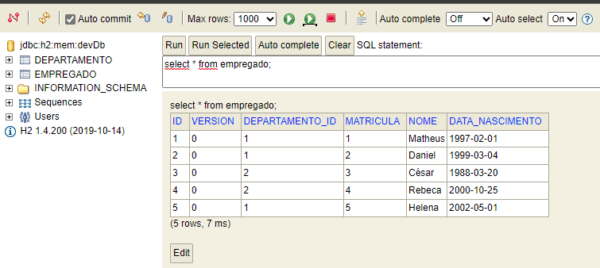

# API-REST-Empregados
## **Descrição**

Este é um projeto de uma API desenvolvida em Groovy on Grails, que fornece endpoints para gerenciar empregados e departamentos. A API é projetada para aceitar e retornar dados no formato JSON e utiliza o banco de dados H2 como armazenamento.

# **Pré-requisitos**
Antes de executar a API, certifique-se de ter o seguinte instalado em sua máquina:

* **[Grails](https://grails.org/download.html)** (versão 5.3.2 ou superior)
* **[Java Development Kit (JDK)](https://www.oracle.com/br/java/technologies/javase/javase8-archive-downloads.html)** (versão 8 ou 11)

Set as variáveis de ambiente`GRAILS_HOME` apontando para o diretório de instalação do Grails.

Adicione `%GRAILS_HOME%\bin;%JAVA_HOME%\bin` ao final da variável PATH.
# Execução

Para executar a API localmente, use o seguinte comando pelo Prompt no caminho do projeto:

`grails run-app`

A API estará disponível em http://localhost:8080/api.

# Endpoints

A API possui dois domínios: Empregado e Departamento. Ambos possuem os mesmos endpoints configurados conforme abaixo.

- `GET api/empregado` - Retorna a lista de todos os empregados.
- `GET api/empregado/{id}` - Retorna os detalhes de um empregado específico.
- `POST api/empregado` - Cria um novo empregado.
- `PUT api/empregado/{id}` -  Atualiza os detalhes de um empregado existente.
- `DELETE api/empregado/{id}` - Remove um empregado.
# Armazenamento
Os dados são salvos no banco H2, dessa forma, criando a estrutura de tabelas quando iniciar a aplicação e excluíndo quando finaliza-la.

Acesso ao console: http://localhost:8080/API/h2-console/
- JDBC URL: jdbc:h2:mem:devDb
- User name: admin
- Password: 123
